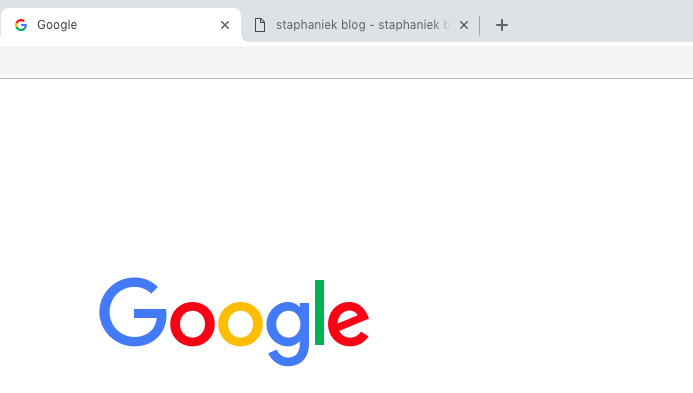
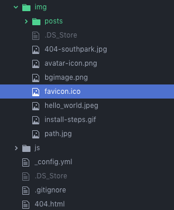
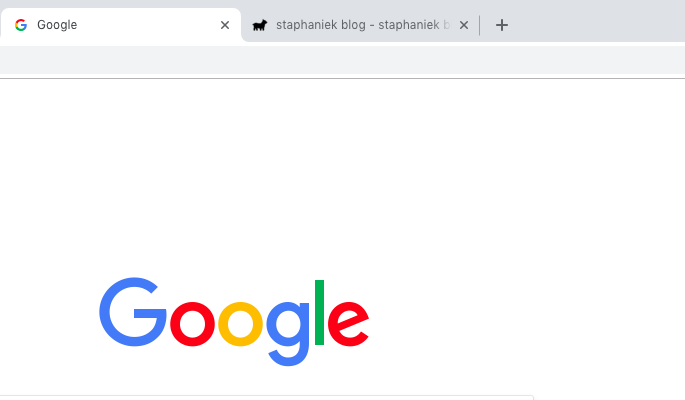

블로그를 만들고 오랫만에 들어와보니 (쓴 글도 없지만 ㅋㅋㅋ) 상단 탭에 상당히 거슬리는 부분이 있었습니다.<br>
<br>
사진에서 보시는 바와 같이 탭에서 구글 옆에는 예쁜 구글 로고가 있었지만 제 블로그 옆에는 그냥 종이 접혀있는 저 불성실한 아이콘만 있다는 점이었습니다.<br>
그래서 일단 저 탭에 들어있는 로고가 무엇인지 검색해보았습니다. `favicon`이라는 이름으로 불리더라구요. <br>
그 다음에는 아이콘으로 사용할 이미지를 만들었습니다. 만드는 방법은 직접 도트를 찍거나, 'free favicon' 등등으로 검색하면(저작권 있는 것들은 몰래 사용하면 슬퍼지니까...) 취향에 맞는 아이콘들을 얻을 수 있습니다.<br>
만든 후에는 거 머시냐 Jekyll 루트 디렉토리(`_config.yml` 파일이 있는 곳)나 assets 등 원하시는 곳에 옮겨주시면 됩니다. .png 등의 사진 파일들도 가능하나, 사진을 넣으면 `.ico` 파일로 변환해주는 무료 사이트도 있으니 그냥 맘편하게 '.ico' 파일을 만들어주시면 됩니다.<br>
&nbsp;&nbsp;&nbsp;&nbsp;&nbsp;&nbsp;&nbsp;<br>
참고로 저는 `img/`에 "favicon.ico"라는 이름으로 넣었습니다.<br>
그 후 `_includes` 폴더의 `head.html`에 다음 한 줄을 왠만하면 title 태그(`<title>`) 위쪽에 넣어주시면 됩니다.
```
  <link rel="shortcut icon" type="image/x-icon" href="/img/favicon.ico?">
```
저 코드의 대략적인 의미는 `img`폴더 안의 `favicon.ico` 파일을 x-icon 형식으로 가져와서 그려달라는 뜻이 되겠네요.<br>
그래서 저 코드를 추가하면 블로그에 들어갔을 때 탭이 이렇게 변합니다.<br>
&nbsp;&nbsp;&nbsp;&nbsp;&nbsp;&nbsp;&nbsp;<br>
탭 맨 앞에 아이콘이 추가된 것을 확인할 수 있습니다.<br>
여기까지가 블로그 탭 맨 앞에 아이콘을 넣는 방법에 대한 소개였고, 이 글을 쓰다보니 Jekyll markdown 형식에서 이미지를 어떻게 넣어야 하는지도 모르겠더군요. 검색해보니 Jekyll에서 보편적으로 사용하는 마크다운인 `kramdown`에서는 다음과 같은 방법들로 이미지를 가져올 수 있다고 합니다. 혹시나 해서 적어놔요 ㅎㅎ
```markdown
- 
- 
- 
- 
```
끝입니당! 하하하!
